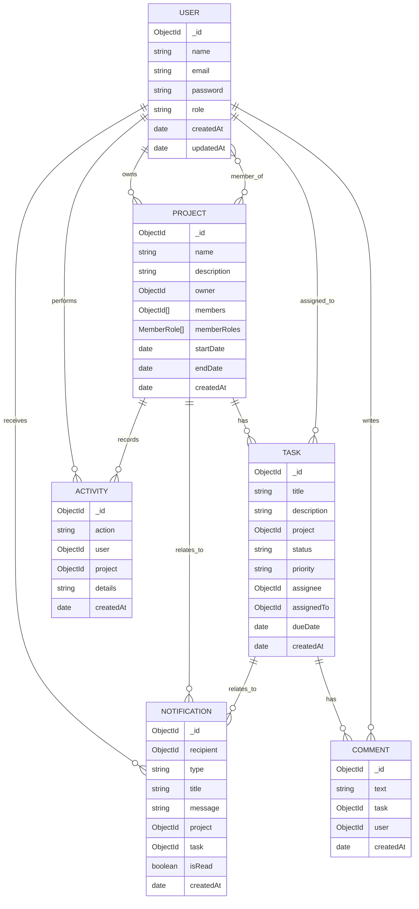

# FlowTrack ER Diagram

## Notes

- `Project.owner` is the project creator.
- `Project.members` stores project members as `User` references.
- `Project.memberRoles` stores project-specific roles, so a user can be a leader in one project and a member in another.
- `Task.assignedTo` is the active assignee field used across controllers and UI.
- `Task.assignee` also exists in the schema, but appears redundant in the current implementation.
